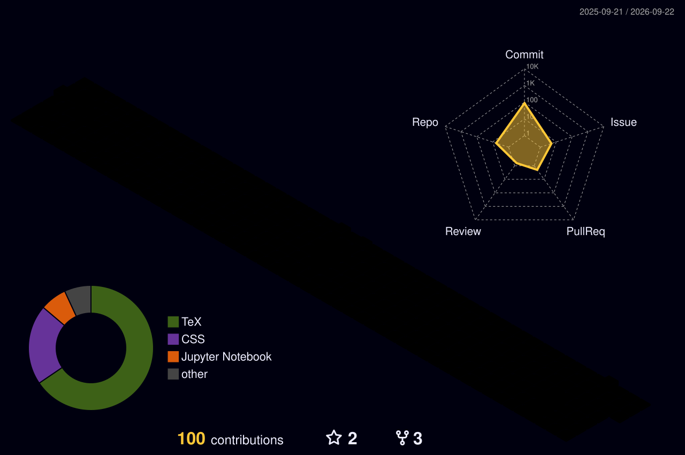

<h1 align="center" style="font-family: 'Noto Sans', sans-serif;">
  Hi 👋, I'm Kanonlas Rattanapak
</h1>

- 🌱 I’m currently learning **Java, Unity, everything**

- 👨‍💻 All of my projects are available at [https://github.com/kanonlas](https://github.com/kanonlas)

- 📫 How to reach me **kanonlas.r@gmail.com**

- ⚡ Fun fact **my hobbies is learning new technologies**

<h3 align="left">Connect with me:</h3>

<h3 align="left">all my stack profile:</h3>

  

